<h1 align="center">Hi 👋, I'm DongRyeol</h1>

## 🌱 Interests
- **Agent Harness**
  - Coding agents, tool calling, context management, verifying agent output with independent checks
- **Inference Infrastructure**
  - LLM serving with vLLM, shared in-house inference for a whole team
- **Training Efficiency of Small Models**
  - RL for shorter reasoning (GRPO + LoRA), parameter-efficient fine-tuning, small Korean LMs
- **On-premise RAG**
  - Document parsing, retrieval, and guardrails for regulated domains

## 🔭 Careers
- Senior Researcher, AI Agent Team at [**Clush**](https://www.clush.ai) (2026.05 - PRESENT)
  - **inner-inference**: in-house LLM inference server used by the whole AI Agent team (about 10 people)
  - [**koda**](https://github.com/DONGRYEOLLEE1/koda): terminal coding agent PoC that classifies each request and verifies edits with evidence
- Researcher, AI Solution Team at **Bigster** (2022.07 - 2026.04)
  - **DalpinChat Mediguide**: RAG assistant for hospital accreditation reviews, used in a National Cancer Center pilot
  - **DalpinChat**: on-premise RAG platform and shared SDK behind the company's services
  - **AskBiz**: economics and business chatbot on a 12.8B Korean model fine-tuned on DBR articles, with retrieval
  - **MMAgent**: agent that finds internal meeting minutes, summarizes them, and sends them by email
  - **Digital Economics Education Platform**: pipeline that extracts economic text from videos and images and classifies it
  - **Counseling Skill Evaluation**: counseling audio transcribed with Whisper and classified with BERT

## 🧪 Research & Projects
- [**ThinkingCap**](https://github.com/DONGRYEOLLEE1/reducing-think-token) · [🤗 Model](https://huggingface.co/drlee1/ThinkingCap-Qwen3.5-2B)
  - GRPO + LoRA on Qwen3.5-2B: 79% fewer thinking tokens, accuracy 69.0% → 90.7% on 300 held-out problems
- **kotraj** · [🤗 Model](https://huggingface.co/drlee1/kotraj-qwen3.5-2B) · [🤗 Dataset](https://huggingface.co/datasets/drlee1/kotraj) · [🤗 Bench](https://huggingface.co/datasets/drlee1/kotraj-bench)
  - Korean multi-turn tool calling: three-in-a-row success 31% → 60% on a 290-task bench with a 2B model
- [**LoCAL**](https://github.com/DONGRYEOLLEE1/LoCAL) · [Report](https://github.com/DONGRYEOLLEE1/LoCAL/blob/main/paper/report.md)
  - Where should LoRA go? Spreading it across layers learned better than packing it into the layers where the capability sits (Qwen3-1.7B, same 1.87M parameters)
- **HanForge** · [🤗 Base](https://huggingface.co/drlee1/HanForge-base) · [🤗 SFT](https://huggingface.co/drlee1/HanForge-47M-SFT)
  - 35M Korean LM pretrained from scratch; fixing three loading defects took SFT validation perplexity from 37.83 to 9.78
- [**OrchAgent**](https://github.com/DONGRYEOLLEE1/orchagent)
  - Web app that splits a request across five AI agent teams and streams their progress live

## 🤝 Contributions
- [**vllm-project/vllm-metal**](https://github.com/vllm-project/vllm-metal)
  - [#459](https://github.com/vllm-project/vllm-metal/pull/459) (merged): added EXAONE 4.0 1.2B support on Apple Silicon
- [**vllm-project/vllm**](https://github.com/vllm-project/vllm)
  - [#53896](https://github.com/vllm-project/vllm/pull/53896#issuecomment-5448519787): tested Qwen3.8-Flash-Next support and reported serving measurements
  - [#53899](https://github.com/vllm-project/vllm/pull/53899#issuecomment-5448518741): proposed a preflight check for PLE CPU offload in containers that block `pidfd_getfd`

## ⚡ Blog & Models
- Tech blog (Korean): [**dongryeollee1.github.io**](https://dongryeollee1.github.io/)
- Models and datasets: [**Hugging Face**](https://huggingface.co/drlee1)

## 🔥 AI Token Usage
<a href="https://tokscale.ai/u/DONGRYEOLLEE1">
  <picture>
    <source media="(prefers-color-scheme: dark)" srcset="https://tokscale.ai/api/embed/DONGRYEOLLEE1/svg?template=graph&theme=dark" />
    
  </picture>
</a>

## 📫 Contacts
- Email: [cmeig21@gmail.com](mailto:cmeig21@gmail.com)

